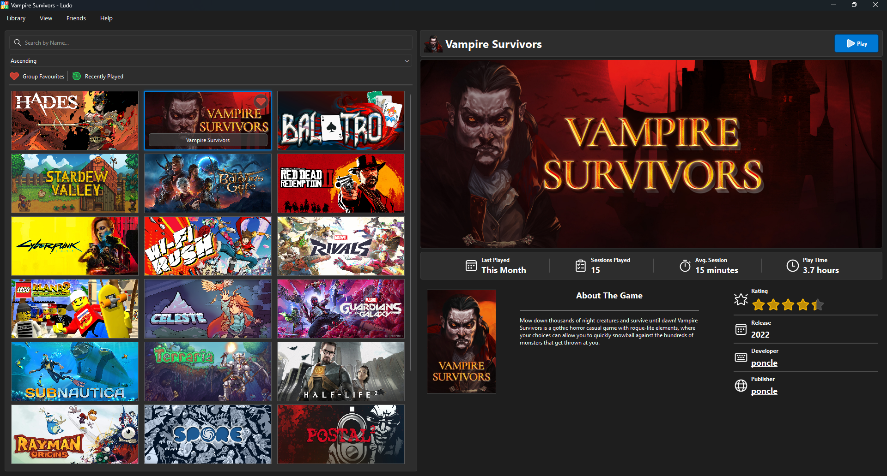

# Ludo - *Video game launcher/manager* 🎮🐍

**Ludo** is a universal game launcher designed to unify all your gaming platforms into a single, seamless experience. Built with *PySide6/Qt*, **Ludo** offers a fast, native desktop experience with a customizable interface.

## To-Do

- [ ] Architect plugin API (not completed)
- [ ] SteamGridDB integration (not completed)
- [ ] WINE/Proton support for Linux (not completed)

## Important Notice

***Ludo** is under active development. All features, design, and functionality are subject to change as the project evolves.*

## License

This project is distributed under the [Mozilla Public License (MPL v2.0)](https://www.mozilla.org/en-US/MPL/2.0/).

Copyright © 2025, Killian-W.
